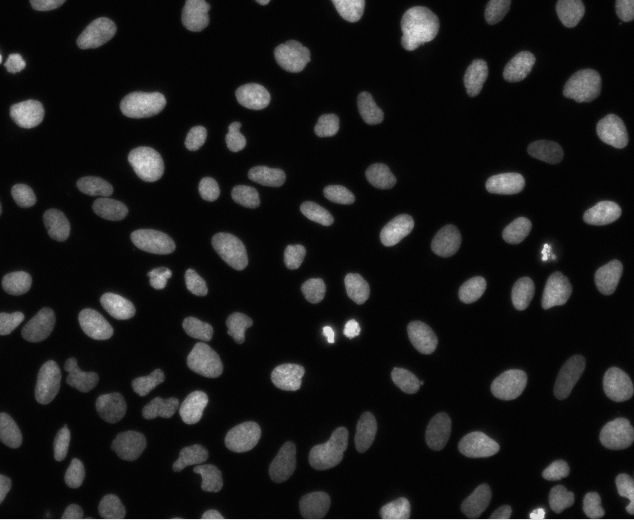

# Computer-Vision-Cell-Labeling

This MATLAB project processes an image of cells, identifies connected objects using a Depth-First Search (DFS) algorithm, calculates the area of each cell, and computes the average brightness level of the cells. The results are outputted to an Excel file.

## Input Example

